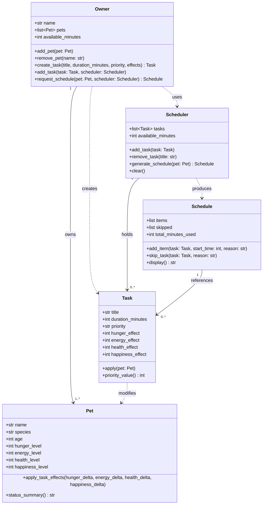

# PawPal+ Class Diagram

```mermaid
classDiagram
    class Owner {
        +str name
        +list~Pet~ pets
        +int available_minutes
        +add_pet(pet: Pet)
        +remove_pet(name: str)
        +create_task(title, duration_minutes, priority, effects) Task
        +add_task(task: Task, scheduler: Scheduler)
        +request_schedule(pet: Pet, scheduler: Scheduler) Schedule
    }

    class Pet {
        +str name
        +str species
        +int age
        +int hunger_level
        +int energy_level
        +int health_level
        +int happiness_level
        +apply_task_effects(hunger_delta, energy_delta, health_delta, happiness_delta)
        +status_summary() str
    }

    class Task {
        +str title
        +int duration_minutes
        +str priority
        +int hunger_effect
        +int energy_effect
        +int health_effect
        +int happiness_effect
        +apply(pet: Pet)
        +priority_value() int
    }

    class Scheduler {
        +list~Task~ tasks
        +int available_minutes
        +add_task(task: Task)
        +remove_task(title: str)
        +generate_schedule(pet: Pet) Schedule
        +clear()
    }

    class Schedule {
        +list items
        +list skipped
        +int total_minutes_used
        +add_item(task: Task, start_time: int, reason: str)
        +skip_task(task: Task, reason: str)
        +display() str
    }

    Owner "1" --> "1..*" Pet : owns
    Owner ..> Scheduler : uses
    Owner ..> Task : creates
    Scheduler "1" --> "0..*" Task : holds
    Scheduler ..> Schedule : produces
    Schedule "1" --> "0..*" Task : references
    Task ..> Pet : modifies
```
